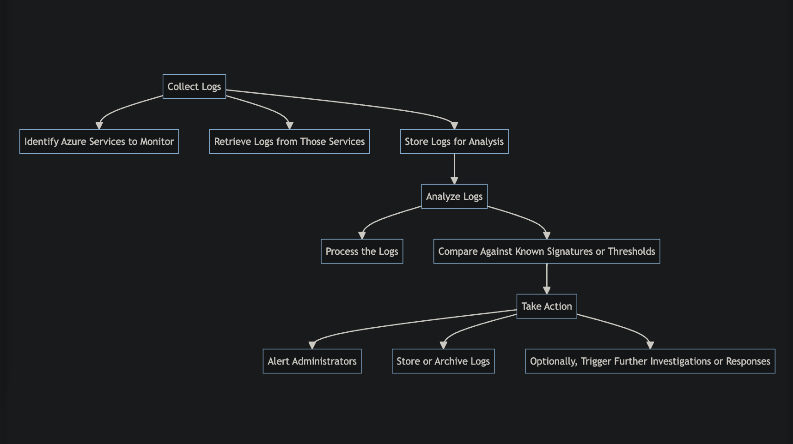

# Azure Storage Scanner

Azure Storage Scanner is a tool designed to identify and report publicly accessible objects in Azure Storage Accounts. It's an essential utility for maintaining the security and integrity of your Azure storage resources.

## Overview

This tool automates the process of scanning Azure Storage Accounts to find containers with public access permissions. It can be used as part of a security audit or continuous monitoring system.

## Flowchart

## Installation

Provide instructions on how to install and configure the tool.

## Usage

Provide examples and explanations on how to use the tool.

## Contributing

If you would like to contribute to this project, please follow the contributing guidelines.