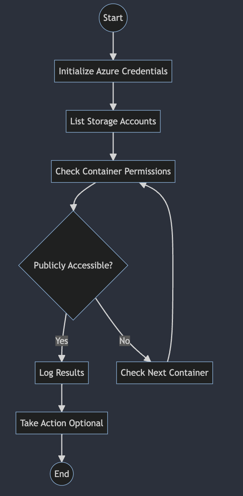

# Azure Log Collection and Analysis

`azure-log-analysis` is a script project designed to automate the collection and analysis of logs from various Azure services. It identifies specific patterns or anomalies and takes appropriate actions, such as alerting administrators or triggering further investigations.

## Overview

The project consists of three main steps:

1. **Collect Logs:** Identify the Azure services to monitor, retrieve logs from those services, and store them for analysis.
2. **Analyze Logs:** Process the logs to identify specific patterns or anomalies and compare them against known signatures or thresholds.
3. **Take Action:** Alert administrators if suspicious activities are detected, store or archive logs, and optionally trigger further investigations or responses.

## Flowchart

## Installation

Provide detailed instructions on how to install and configure the project.

## Usage

Provide examples and explanations on how to use the project, including any available options and parameters.

## Contributing

If you would like to contribute to this project, please follow the standard GitHub pull request process.

## Contact

For questions, issues, or feedback, please [create an issue](https://github.com/yourusername/azure-log-analysis/issues) in the GitHub repository.